# How to load the DTC from DKS for VFA-136 missions

>Document version 1.0 (Updated: 2026-10-07)

## Introduction

Here is the guide to loading your DTC from DKS in the F/A-18C jet

## Installation Steps

### Step 1 - Click the DKS briefing link and download your assigned flight slot package, and install it.

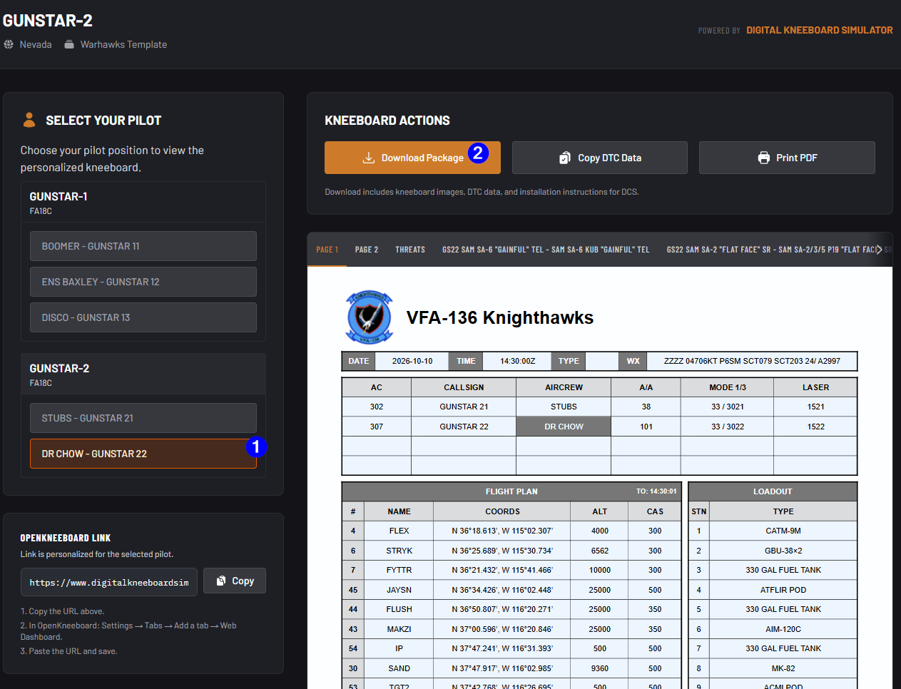

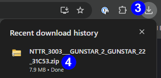

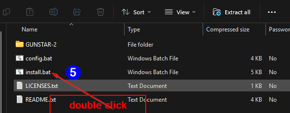

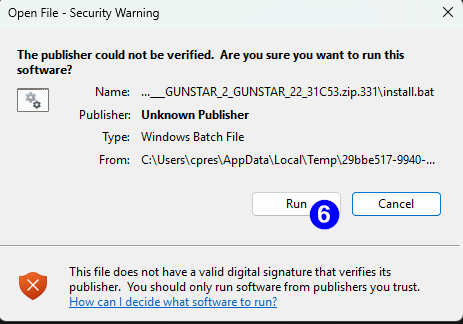

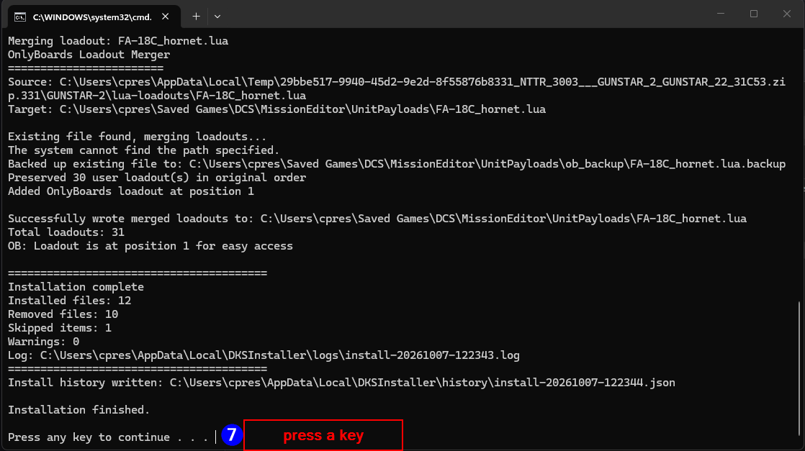

### Step 2 - Connect to the server and pick your slot as usual, before clicking "Fly" click "Open DTC"

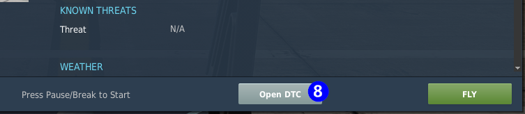

### Step 3 - Load your DTC file

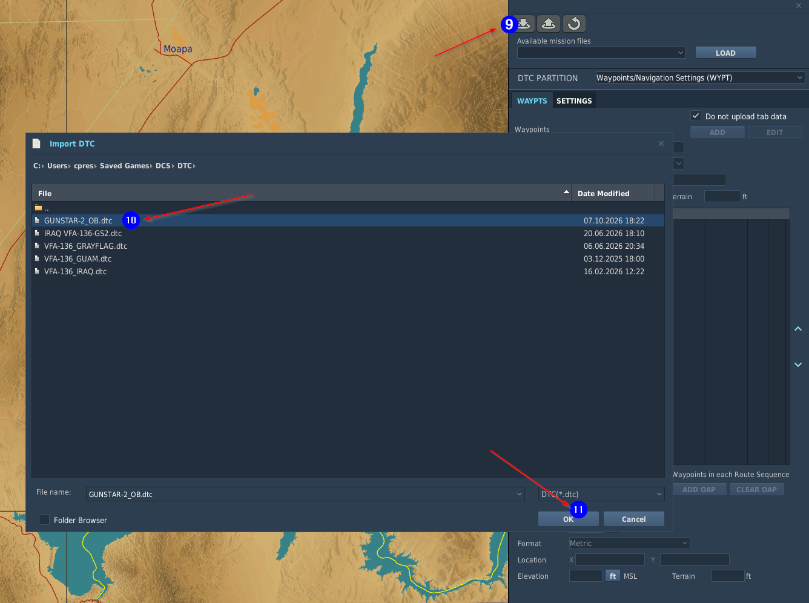

### Step 4 - Verify your DTC settings across Waypoints, Communications, SA page, etc..

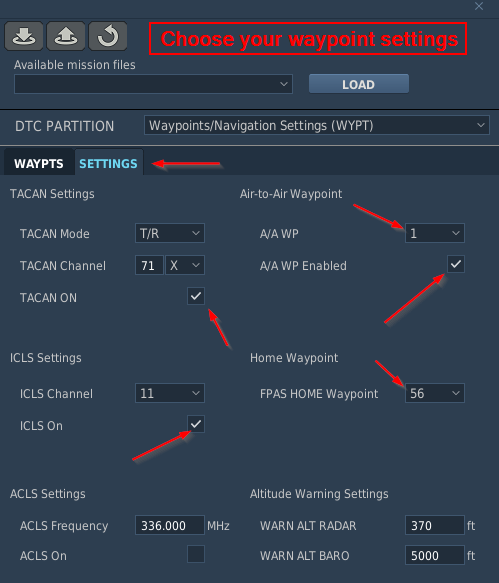

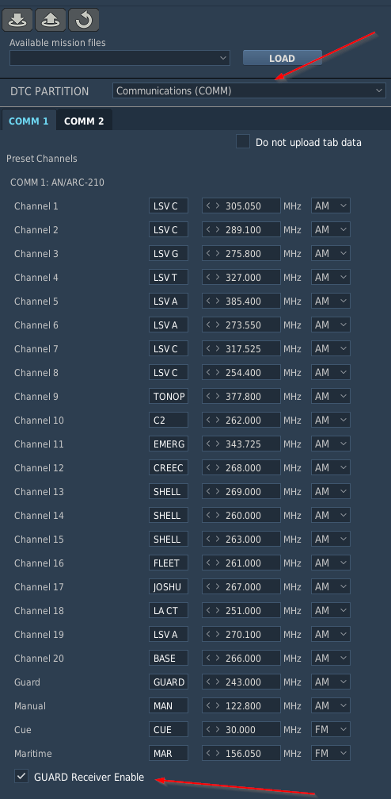

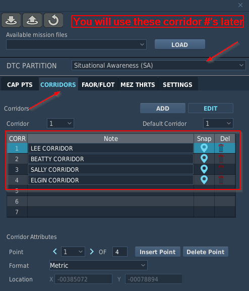

#### Note: remember your corridor #'s as you will reference and load these later

#### Click the "X" at the top right when done

### Step 5 - Load your DTC in the MUMI page by boxing the various sections

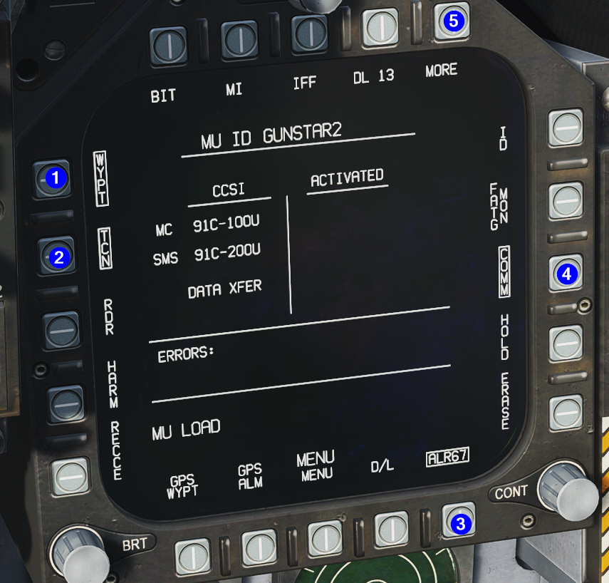

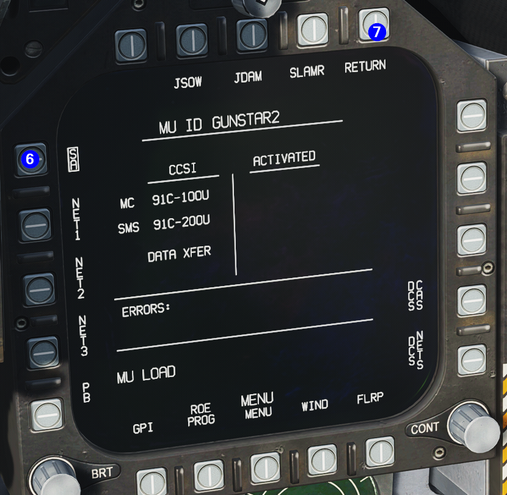

### Step 6 - To change your selected corridor, on the SA page, click DCLTR

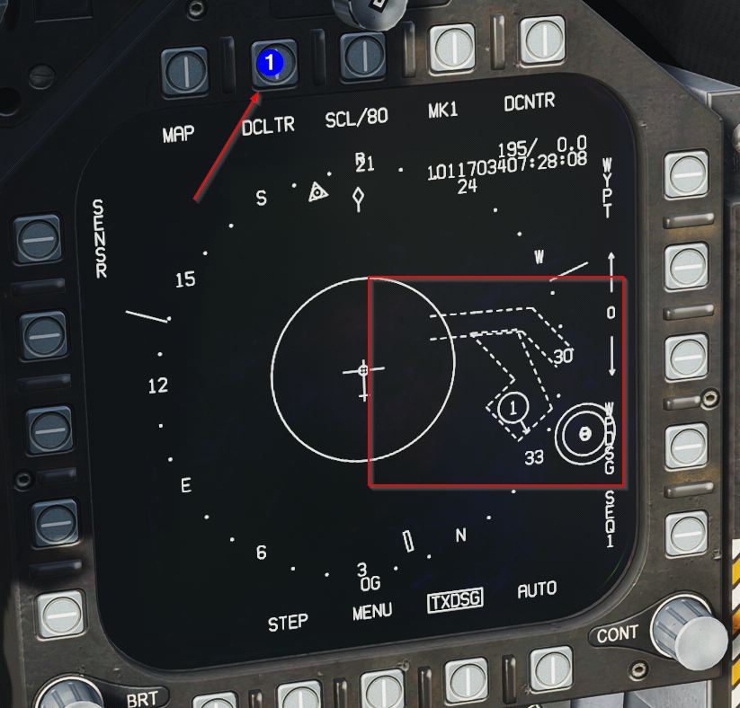

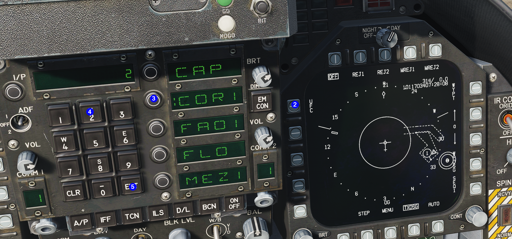

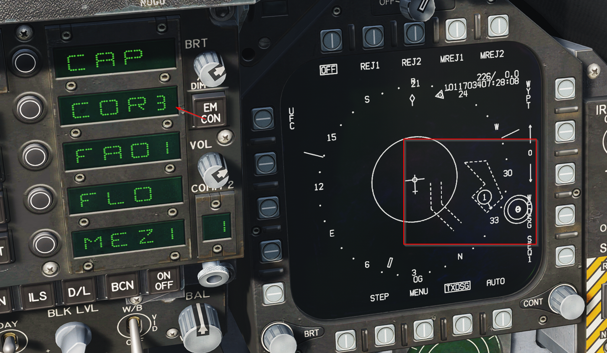

#### In the last screenshot, we changed to Corridor #3 (Sally Corridor)

#### Click "Off" when done
